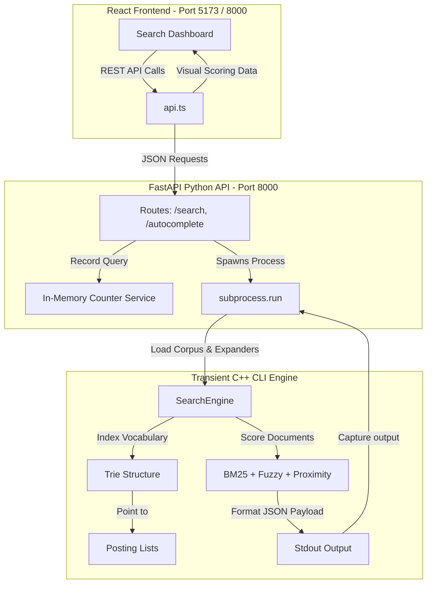
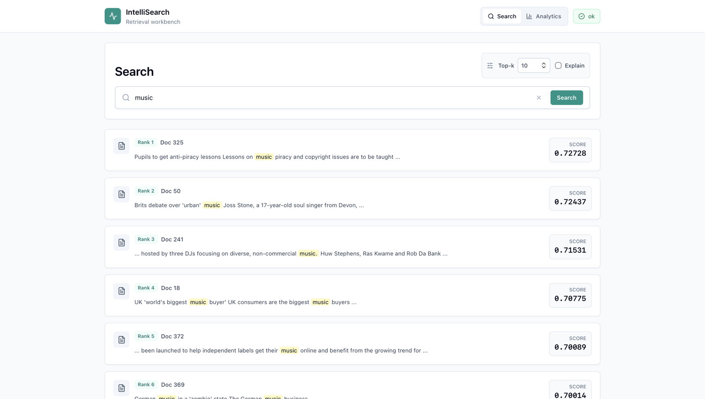
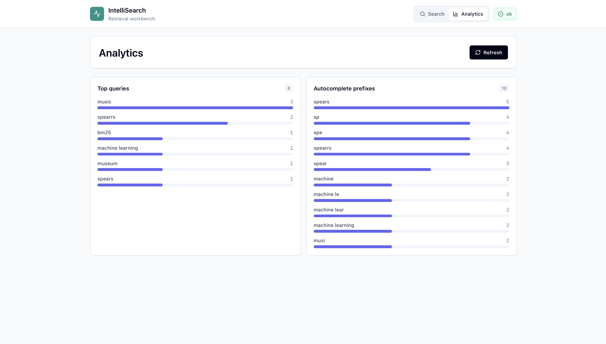
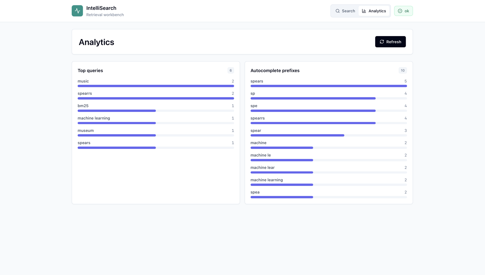

# IntelliSearch 🚀

[](https://github.com/sakshamagg28/IntelliSearch/actions/workflows/ci.yml) 
[](https://en.cppreference.com/w/cpp/11)
[](https://fastapi.tiangolo.com)
[](https://react.dev)
[](https://opensource.org/licenses/MIT)

**IntelliSearch** is a systems-oriented search platform featuring a custom-built C++ retrieval engine under the hood, integrated with a FastAPI Python web backend and a modern React single-page dashboard. 

This platform showcases the practical implementation of core computer science structures—such as inverted indices, child-sibling Trie prefix caches, edit-distance spelling tolerance, and phrase proximity verification—to serve queries under millisecond latencies.

---

## 🎯 Recruiter Highlights

- **Custom Systems-Level Core**: Built entirely in C++ using RAII and smart pointers (`std::unique_ptr`) to ensure memory efficiency and avoid leaks.
- **Classic Information Retrieval**: Implements **Okapi BM25** relevance ranking with customizable hyperparameters ($k_1$, $b$).
- **Algorithmic Typos Tolerance**: Computes spelling corrections on-the-fly using Levenshtein distance calculations.
- **Explainable Ranking**: The UI visualizes individual scoring weights (BM25, Fuzzy edit penalty, Synonym expansions, Phrase proximity boosts) so you see exactly *why* a document was ranked first.
- **Enterprise-Ready Infrastructure**: Fully Dockerized (multi-stage build), orchestrated via Docker Compose, and verified automatically with GitHub Actions CI workflows.

---

## ⚡ Quick Run

Run IntelliSearch using Docker:

```bash
docker build -t intellisearch .
docker run -p 8000:8000 intellisearch
```

Open:

```text
http://localhost:8000
```

---

## 🏗️ Architecture Overview

The system is organized into decoupled layers: a backend storage core, a thin REST layer, and a client interface.



### Folder Layout
```text
IntelliSearch/
├── .github/workflows/       GitHub Actions CI workflows
├── backend/                  FastAPI python app factory, routers, and schemas
├── datasets/                 Plain-text document collections
├── docs/                     System design documentation
├── frontend/                 React + TypeScript Vite dashboard
├── include/                  Public C++ headers (Trie, PostingList, Engine)
├── src/                      C++ source files (tokenizers, score algorithms)
├── tests/                    Regression verification test workspace
├── Dockerfile                Multi-stage build recipe
├── docker-compose.yml        Local stack orchestrator
├── Makefile                  Unified builder
└── README.md                 Documentation
```

---

## ⚡ Quick Start (Local & Docker)

Ensure you have a C++ compiler (`g++`), Python `3.11+`, and Node.js `20+` installed.

### Option A: Bare-Metal Setup (Local Development)

#### 1. Compile the C++ Engine
```bash
make
```
This builds the interactive CLI tool `./search_engine` and the API runner `./search_engine_api`.

#### 2. Start the Backend API
Install dependencies and run FastAPI using Uvicorn:
```bash
pip install -r backend/requirements.txt
export INTELLISEARCH_DATASET=datasets/smallDataset.txt
export INTELLISEARCH_CORE_BINARY=./search_engine_api
python -m uvicorn backend.main:app --reload --host 127.0.0.1 --port 8000
```

#### 3. Start the Frontend
In a new terminal window, build and run the development frontend:
```bash
cd frontend
npm install
npm run dev
```
Open `http://localhost:5173` in your browser.

---

### Option B: Single-Command Docker Setup 🐳

We provide a production-ready, multi-stage `Dockerfile` that packages both the frontend and backend together. The React frontend is compiled and served directly from FastAPI, removing CORS concerns and simplifying setup.

#### Using Docker Compose (Recommended)
```bash
docker compose up --build
```
This builds the unified stack and starts it at **`http://localhost:8000`**.

#### Using Makefile Utilities
We provide easy commands inside the `Makefile` for raw Docker operations:
```bash
make docker-build   # Build the unified image
make docker-run     # Run the container on port 8000
```

---

## 📖 Component Breakdown

### 1. C++ Retrieval Engine
- **Inverted Index**: Maps tokens to sorted lists of `(doc_id, tf)` pairs. It allows $O(\log \text{docs})$ matching during search operations.
- **Trie Prefix Autocomplete**: A custom child-sibling ternary structure storing dictionary tokens for autocomplete lookups in $O(M)$ length complexity, feeding the frontend suggestions on-the-fly.
- **BM25 Relevance Scoring**: Okapi BM25 implementation:
  $$Score(D, Q) = \sum_{q \in Q} IDF(q) \cdot \frac{f(q, D) \cdot (k_1 + 1)}{f(q, D) + k_1 \cdot \left(1 - b + b \cdot \frac{|D|}{avgdl}\right)}$$
- **Fuzzy Matcher**: Compares typo queries with the indexed vocabulary using Levenshtein edit distance, penalizing score proportionally to the distance.
- **Query Expansion**: Modifies bag-of-words tokens to insert aliases (e.g., alias `ml` expands into `machine learning`), improving search recall.

### 2. Interactive CLI Commands
Run the interactive console locally:
```bash
./search_engine -i datasets/smallDataset.txt -k 5
```
Commands available:
```text
/search <terms...>       Rank documents using BM25
/search --explain <...>  Show scoring metrics
/topk <number>           Adjust results limit for the current session
/explain <on|off>        Toggle explainability logs
/suggest <prefix> [n]    Print autocomplete lists
/analytics               Print search usage telemetry
/df [term]               Inspect document frequency of a token
/tf <doc_id> <term>      Inspect term frequency in a document
/exit                    Quit IntelliSearch
```

### 3. REST API Endpoints
FastAPI maps queries to C++ runner pipes:
- `POST /search`: Evaluates queries and outputs ranking reports.
- `GET /autocomplete?q=<prefix>&limit=<n>`: Fetches autocomplete suggestions.
- `GET /analytics`: Inspects search term and prefix click history.
- `GET /health`: Diagnoses file and binary health.

---

## 🚢 Cloud Deployment Guide

Because the application compiles to a single multi-stage image, it can be deployed on popular PaaS systems with one click.

### Deploying to Render
1. Create a new **Web Service** on Render and connect your GitHub repository.
2. Select **Docker** as the Environment.
3. Add the following Environment Variables in the Render console:
   - `INTELLISEARCH_DATASET` = `datasets/smallDataset.txt`
   - `INTELLISEARCH_CORE_BINARY` = `/app/search_engine_api`
   - `PORT` = `8000` (Render binds this port automatically)
4. Click **Deploy Web Service**.

### Deploying to Railway
1. Create a new project on Railway and link your repository.
2. Railway will automatically detect the root `Dockerfile` and execute the multi-stage build.
3. Configure the `PORT` variable to `8000`.
4. Expose the service to generate a public domain link.

---

## 📸 Screenshots & Explainability Dashboard

### 1. Search Experience

Demonstrates ranked retrieval using the custom C++ inverted index and BM25 scoring engine.



---

### 2. Explainable Ranking & Fuzzy Search

Shows typo-tolerant retrieval using Levenshtein-distance fuzzy matching along with a detailed relevance score breakdown (BM25, fuzzy match contribution, phrase boosts, and query expansions).



---

### 3. Analytics Dashboard

Displays tracked search queries and autocomplete usage statistics collected through the FastAPI analytics layer.



